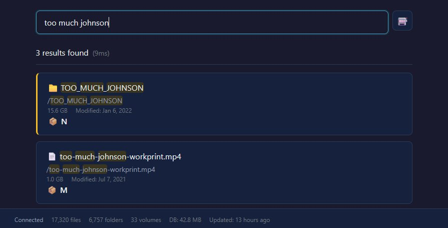

# WebCatalog

[](https://github.com/djjeck/webcatalog/actions/workflows/ci.yml)

A web-based UI for searching [WinCatalog](https://www.wincatalog.com/) databases.

## Overview

WebCatalog is a web-based, mobile-friendly search interface for <a href="https://www.wincatalog.com/" target="_blank">WinCatalog 2024</a> catalogs.

Load a .w3cat file and WebCatalog will let you search its contents to determine which volume contains a specific file or folder, along with its size and latest modification date.



## Features

- **Web interface** A basic, lightweight text-based search interface that works on any browser, including mobile devices
- **Read-only operation** WebCatalog never modifies your existing .w3cat file
- **Auto-refresh** Automatically detects when the .w3cat file is modified and reloads its contents
- **Pattern and size filtering** Exclude specific patterns or file types and set a minimum file size to filter results
- **"I feel lucky" search** Click the slot-machine icon to perform a random search query

## Quick Start

### Using Docker Compose (Recommended)

1. Create a `docker-compose.yml` file:

```yaml
# docker-compose.yml
services:
  webcatalog:
    image: djjeck/webcatalog:latest
    # For local builds, replace the line above with:
    # build: .
    container_name: webcatalog
    ports:
      - "3000:3000"
    volumes:
      # Mount your WinCatalog database file (read-only)
      # Replace with your actual database path
      - /path/to/your/My WinCatalog File.w3cat:/data/My WinCatalog File.w3cat:ro
    environment:
      - PORT=3000
      # Optional: exclude system/temp files from search results
      - EXCLUDE_PATTERNS=@eaDir/*,*.tmp,Thumbs.db,.DS_Store
      # Optional: exclude files smaller than a given size (e.g. 100kb, 5MB, 1gb)
      - MIN_FILE_SIZE=100kb
    restart: unless-stopped
    # Resource limits (adjust as needed)
    deploy:
      resources:
        limits:
          memory: 512M
          cpus: "1.0"
    # Logging configuration
    logging:
      driver: json-file
      options:
        max-size: "10m"
        max-file: "3"
```

2. Start the service:
```bash
docker compose up -d
```

3. Open http://localhost:3000

### Using Docker Run

```bash
docker run -d \
  --name webcatalog \
  -p 3000:3000 \
  -v "/path/to/your/My WinCatalog File.w3cat:/data/My WinCatalog File.w3cat:ro" \
  --restart unless-stopped \
  djjeck/webcatalog:latest
```

## Search Syntax

- **Single term**: `vacation` - Finds files/folders containing "vacation"
- **Multiple terms**: `vacation photos 2024` - Finds items containing all three terms (AND logic)
- **Exact phrase**: `"summer vacation"` - Finds exact phrase
- **Mixed**: `vacation "summer 2024" photos` - Combines phrase and individual terms

All searches are case-insensitive, diacritic-insensitive, and use letter folding while still matching partial words. Accented and unaccented variants match each other (for example `cafe` matches `café`, `café` matches `cafe`, `weiss` matches `weiß`, and `weiß` matches `weiss`).

## Configuration

| Variable           | Description                              | Default                          |
| ------------------ | ---------------------------------------- | -------------------------------- |
| `DB_PATH`          | Path to WinCatalog `.w3cat` file         | `/data/My WinCatalog File.w3cat` |
| `EXCLUDE_PATTERNS` | Comma-separated glob patterns to exclude | (none)                           |
| `PORT`             | Server port                              | `3000`                           |
| `MIN_FILE_SIZE`    | Minimum file size to include in results  | (none)                           |

See [Development Guide](docs/DEVELOPMENT.md#environment-variables) for full configuration details.

## Limitations

- **Read-only**: Cannot modify catalog data (by design)
- **No authentication**: Intended for network-protected environments
- **Basic search**: Text-based search only (no advanced filters yet)
- **No thumbnails**: Image previews not currently supported

## Future Enhancements

See [PLAN.md](PLAN.md) for the complete roadmap. Potential features:

- Advanced search filters (file type, size, date)
- Sort options
- Export search results
- Image thumbnails
- Dark mode
- Search history
- Virtual drive status indicators

## Documentation

- [Development Guide](docs/DEVELOPMENT.md) — local setup, scripts, architecture, releasing
- [Deployment Guide](docs/DEPLOYMENT.md) — Docker builds, Synology NAS, troubleshooting
- [Database Schema](docs/DATABASE_SCHEMA.md) — reverse-engineered WinCatalog schema

## Credits

This project was implemented with assistance from **Claude** (Anthropic's AI assistant), including:
- Project architecture and structure
- Database schema reverse-engineering
- TypeScript implementation
- Test suite development
- Documentation

## License

GNU GPL v3.0 License - See [LICENSE](LICENSE) for details.

## Disclaimer

This project is not affiliated with, endorsed by, or associated with [WinCatalog](https://www.wincatalog.com/) or its developers. WinCatalog is a product of its respective owners. This is an independent, community project that reads WinCatalog database files for personal use.

---

Made with ❤️ for WinCatalog users who want web access to their catalogs.
